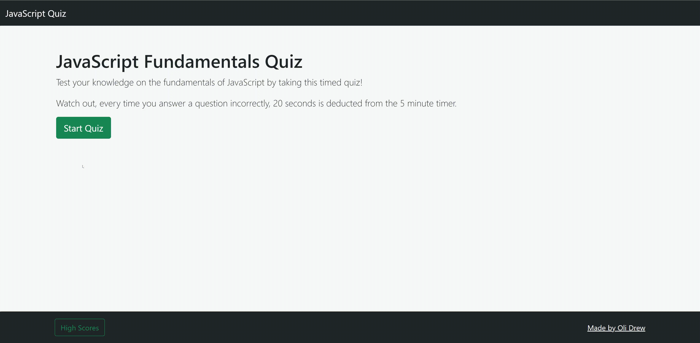

# Timed quiz on JavaScript fundamentals

## Description

A timed quiz on the fundamentals of JavaScript created as part of a homework assignment. The player has 5 minutes to answer the 10 multiple choice questions. If the player answers the a question incorrectly, 20 seconds is deducted from the timer. The quiz ends either when the player has answered all questions correctly or when the time runs out. At the end of the quiz the player can enter 3 initials to have their score saved to the leader board.

**Technology stack:**

- HTML, CSS, and JavaScript
- Bootstrap 5 CSS library
- Deployed to GitHub Pages

## Animated Screenshot

## Link to deployment

https://oli-drew.github.io/timed-quiz-on-javascript-fundamentals-for-bootcamp-hw4/

## License

[MIT License](LICENSE)
